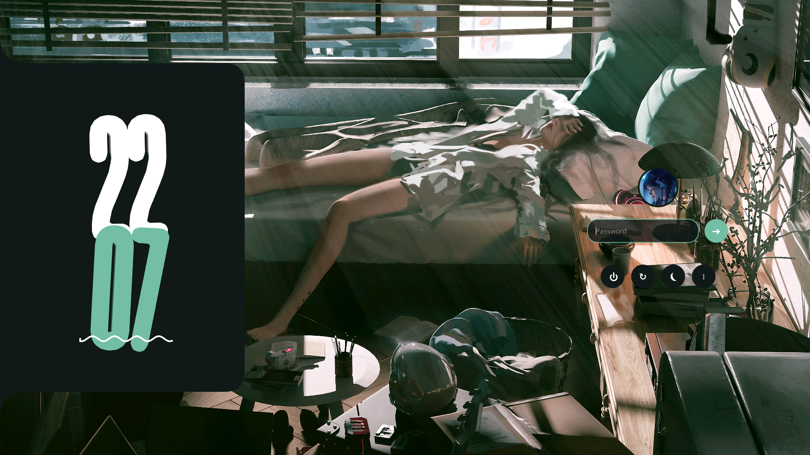

<h1 align="center">
  SDDM Material 3 Theme
</h1>

<p align="center">
  A playful, vibrant Material 3 expressive inspired SDDM theme built with Qt6.
</p>

<p align="center">
  
  
  
</p>

---



## ✨ Features

*   **Dynamic Colors**: Automatically extracts dominant colors from your chosen wallpaper and generates a Material You-like palette for accents and surfaces!
*   **Looks good**: Features large, rounded corners, playful animations, and bold styling.

## 📦 Requirements

Before installing, ensure you have the following packages installed:

*   `sddm` (obviously!)
*   `qt6-declarative` / `qml6-module-qtquick` (depending on your distro's naming)
*   `python3`
*   `python3-pillow` (or `python-pillow`) – used for lightning-fast color extraction.

## 🚀 Installation

```bash
#Clone the repository and cd into it
git clone https://github.com/blumenwagen/sddm-material.git

cd sddm-material

#Install the theme (if you run without arguments, it will ask you for a wallpaper and profile picture)
sudo ./install.sh
```

## 🧪 Testing

To preview the theme without logging out, you can run the SDDM greeter in test mode.

```bash
sddm-greeter-qt6 --test-mode --theme /usr/share/sddm/themes/sddm-material
```

## 🎨 Customization

While the theme automatically generates colors based on your wallpaper, you can override them by manually editing the configuration file located at:

`/usr/share/sddm/themes/sddm-material/theme.conf`

**Available Settings:**
*   `BackgroundColor`
*   `Background` (Path to the wallpaper image)
*   `AccentColor`
*   `AccentColorHover`
*   `SurfaceColor`
*   `TextColor`

<br>

**Special thanks to:**
- Rajesh Rajput for the "Unique" font.
- The Caelestia Project for design inspiration.
- The KDE Project for SDDM.