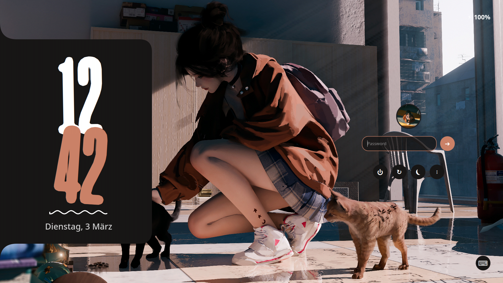

<div align="center">
  
  <h1>✨ SDDM Material</h1>
  <p><b>A playful, vibrant Material Design inspired SDDM theme</b></p>
  <p><i>Dynamic Colors • Beautiful Animations</i></p>

  <p>
    <a href="https://github.com/blumenwagen/sddm-material/blob/main/LICENSE"></a>
    
    
  </p>
</div>

<br>

<p align="center">
   
</p>


## 🚀 Quick Start

### Installation Script:

```bash
git clone https://github.com/blumenwagen/sddm-material.git
cd sddm-material
sudo ./install.sh
```

Requires **SDDM**, **Qt5**, **python3** with **pillow** (for image color extraction), and optionally **ffmpeg** & **qt5-multimedia** (for video backgrounds).
If you run without arguments, the script will automatically ask you for a **wallpaper** (image or video) and an optional **profile picture**.

> [!NOTE]
> You can also run the installer non-interactively by passing the paths directly: 
> `sudo ./install.sh /path/to/my_wallpaper.jpg /path/to/my_pfp.png`
> 
> Video backgrounds work the same way:
> `sudo ./install.sh /path/to/my_video.mp4`

### Manual Installation

In case the installation script does not work, you can manually install the theme by following these steps:

1. **Extract Colors (Optional but recommended):**
   ```bash
   python3 update_theme_colors.py /path/to/your/wallpaper.jpg
   ```

2. **Install Fonts:**
   Copy the fonts to your system fonts directory and update the font cache:
   ```bash
   sudo mkdir -p /usr/share/fonts/TTF
   sudo cp -r fonts/Unique_*.otf /usr/share/fonts/TTF/
   sudo fc-cache -f /usr/share/fonts/TTF
   ```

3. **Install Theme Files:**
   Create the theme directory and copy the necessary files:
   ```bash
   sudo mkdir -p /usr/share/sddm/themes/sddm-material
   sudo cp -r Main.qml metadata.desktop theme.conf backgrounds components fonts /usr/share/sddm/themes/sddm-material/
   sudo chmod -R 755 /usr/share/sddm/themes/sddm-material
   ```

4. **Apply Theme:**
   Configure SDDM to use the new theme:
   ```bash
   sudo nano /etc/sddm.conf # Add or edit the following lines:
   [Theme]
   Current=sddm-material
   ```

<br>

## 🧩 Features

| Feature | Description |
|---------|-------------|
| 🎨 **Dynamic Colors** | Automatically extracts dominant colors from your chosen wallpaper and generates a fitting color palette |
| ✨ **Looks Good** | Features large, rounded corners, playful animations, and bold styling |
| 🎬 **Video Backgrounds** | Supports MP4, WebM, AVI, and MKV video files as looping backgrounds |
| 🖼️ **Profile Pictures** | The installer automatically places your profile picture in the correct system location (because I had headaches for 2 hours trying to figure out where to put it) |

<br>

## 💡 Customization

### Changing your Wallpaper
The easiest way to change your wallpaper (and update the colors to match!) is to simply run the installer script again with your new image:
```bash
sudo ./install.sh /path/to/my_new_wallpaper.jpg
```

### Manual Configuration
While the theme automatically generates colors based on your wallpaper, you can override them by manually editing the configuration file located at:
`/usr/share/sddm/themes/sddm-material/theme.conf`

**Available Configuration Keys:**
```ini
BackgroundColor="#122010"
Background="backgrounds/wallpaper.jpg"    # or wallpaper.mp4 for video backgrounds
AccentColor="#72BFA2"
AccentColorHover="#A6D7C5"
SurfaceColor="#141A1A"
TextColor="#FFFFFF"
```

> [!NOTE]
> Video backgrounds (`.mp4`, `.webm`, `.avi`, `.mkv`) are automatically detected and will loop silently. Make sure `qt5-multimedia` and a GStreamer backend are installed on your system.

<br>

## 🧪 Testing

To preview the theme live on your desktop without logging out, you can run the SDDM greeter directly in test mode:

```bash
sddm-greeter --test-mode --theme /usr/share/sddm/themes/sddm-material
```

<br>

## 🤝 Credits

**Special thanks to:**
- **Rajesh Rajput** for the *Unique* font.
- **The Caelestia Project** for design inspiration.
- **The KDE Project** for SDDM.